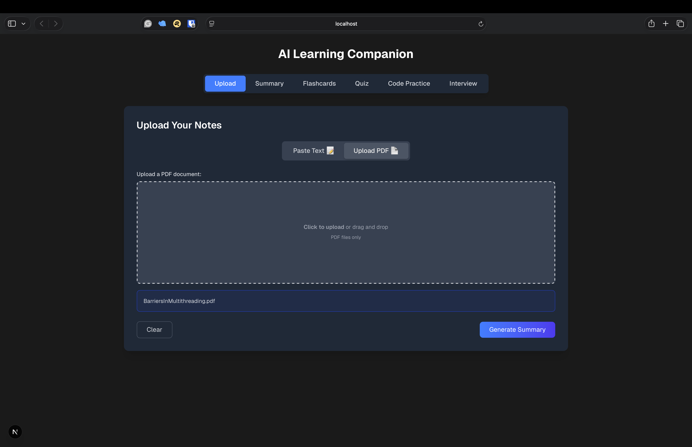
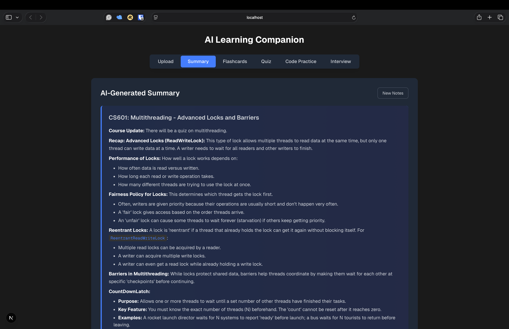
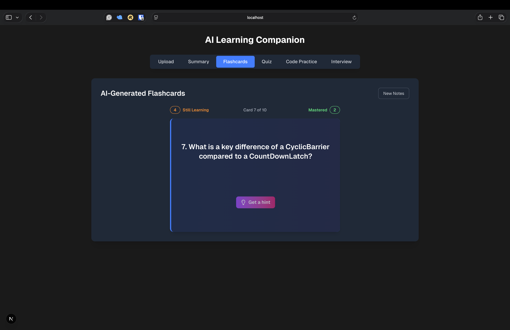
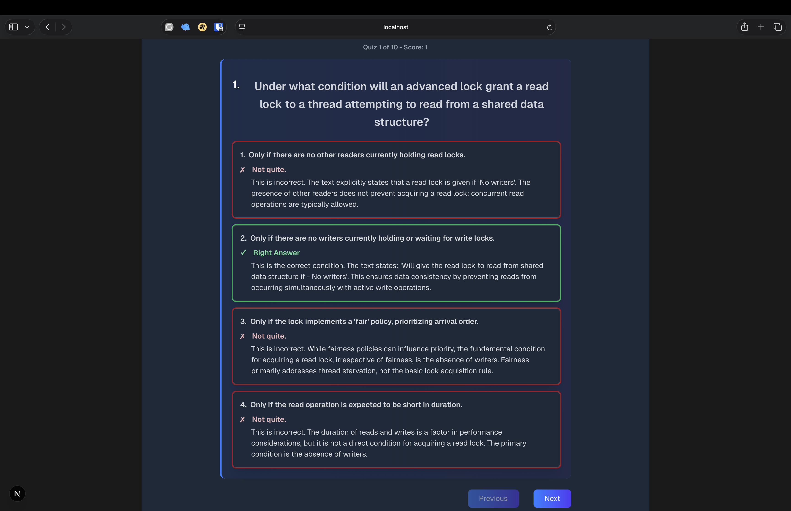
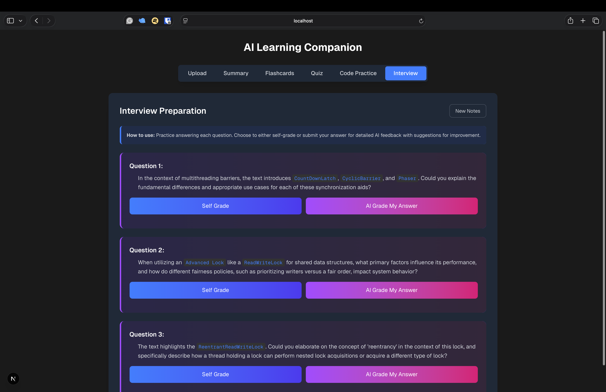
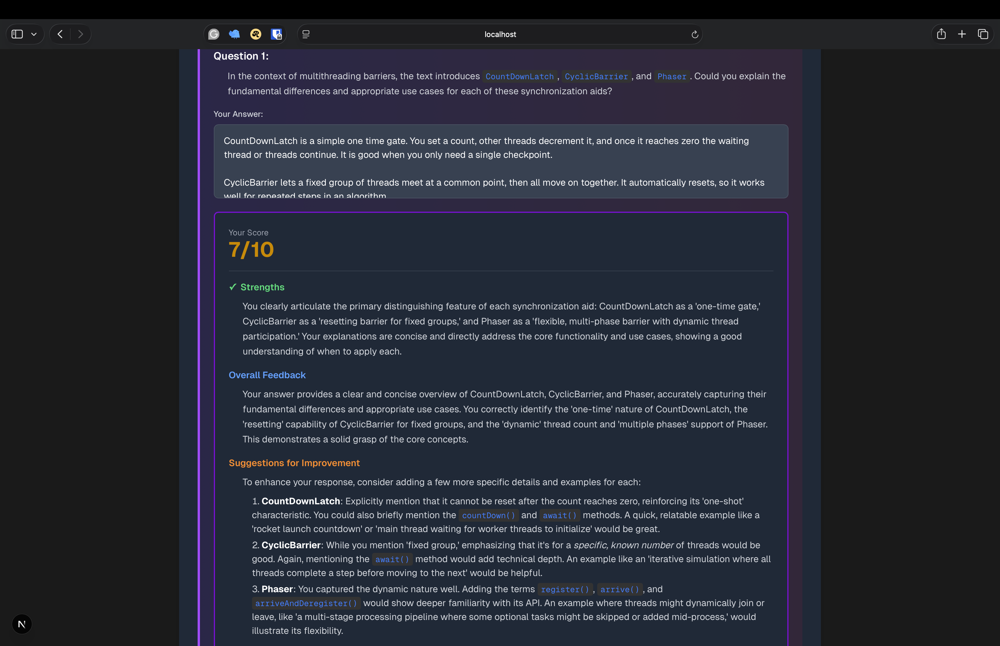
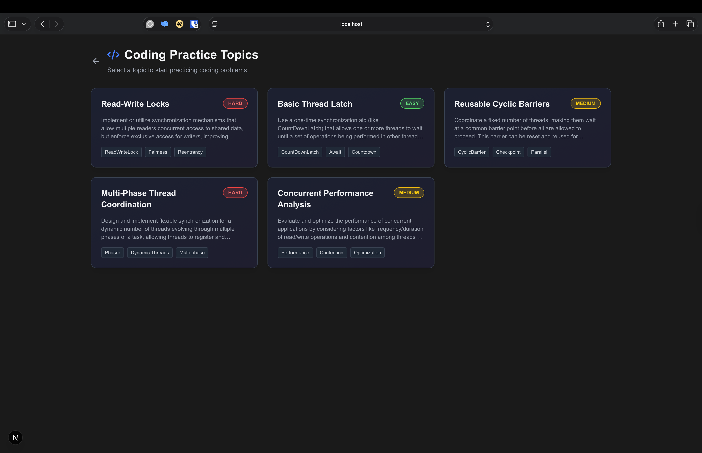
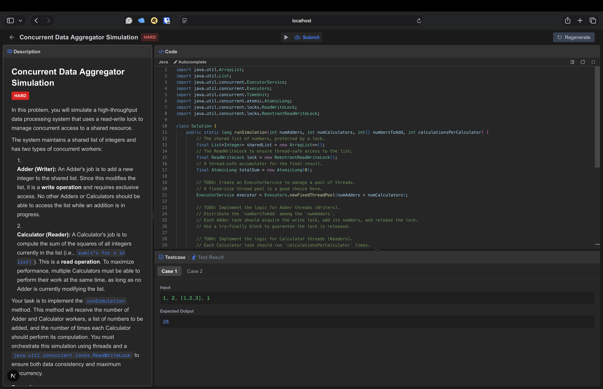

# AI Learning Companion

> **Transform Study Materials into Interactive AI-Powered Learning Experiences**

A full-stack educational platform that leverages AI to convert documents into personalized learning resources—complete with summaries, flashcards, quizzes, interview preparation, and an advanced code practice environment with real-time execution.

<div align="center">

**73 Java Files** • **32 TypeScript Files** • **Full-Stack Architecture** • **AI-Powered**

[Getting Started](#getting-started) • [Features](#features) • [Tech Stack](#technology-stack) • [Architecture](#architecture-overview)

</div>

---

## Overview

AI Learning Companion is an intelligent platform designed to enhance learning through AI-powered content generation and interactive practice. Upload study materials (PDFs or text), and the platform automatically generates comprehensive learning resources tailored to your needs. The standout features are the AI-powered interview preparation with intelligent grading and a sophisticated code practice environment with in-memory compilation and execution—rivaling platforms like LeetCode.

<div align="center">
  
  <p><i>Simple document upload interface—supports PDF and text input</i></p>
</div>

---

## Features

### 📄 Document Processing & AI Content Generation

Upload PDFs or paste text, and let AI transform your materials into structured learning content.

<div align="center">
  
  <p><i>AI-generated summaries with structured overviews and key points</i></p>
</div>

**Key Capabilities:**

-   **PDF Text Extraction**: Automatic parsing using Apache PDFBox
-   **AI Summaries**: Structured summaries with titles, overviews, and key takeaways
-   **Multi-Model Strategy**: Uses Google Gemini Flash for speed, Gemini Pro for complex tasks
-   **Smart Caching**: Session-based repositories prevent redundant AI calls

---

### 🎴 Interactive Study Tools

Engage with your material through AI-generated flashcards and quizzes with detailed explanations.

<div align="center">
  
  <p><i>Interactive flashcards with smooth flip animations</i></p>
</div>

<div align="center">
  
  <p><i>Quizzes with instant feedback and detailed answer explanations</i></p>
</div>

**Features:**

-   **Flashcards**: AI-generated Q&A pairs with Tailwind CSS flip animations
-   **Quizzes**: Multiple-choice questions with real-time scoring
-   **Detailed Feedback**: Comprehensive explanations for each answer
-   **Progress Tracking**: Navigate through questions with "Still Learning" and "Mastered" states

---

### 🎤 Interview Preparation with AI Grading

Practice technical interview questions and receive AI-powered feedback on your answers.

<div align="center">
  
  <p><i>Technical interview questions with self-grading and AI grading options</i></p>
</div>

<div align="center">
  
  <p><i>Detailed AI feedback with scores and actionable improvement suggestions</i></p>
</div>

**Features:**

-   **AI-Generated Questions**: Technical interview questions based on your study materials
-   **AI-Powered Grading**: Submit answers for intelligent scoring (1-10 scale)
-   **Actionable Feedback**: Detailed strengths, areas for improvement, and suggestions
-   **Model Answers**: Access ideal responses for comparison

---

### 💻 Code Practice Platform (Advanced Feature)

A sophisticated coding environment with in-memory Java compilation, execution, and test validation—complete with Monaco Editor integration.

<div align="center">
  
  <p><i>AI extracts 5 programming topics from your study materials with difficulty indicators</i></p>
</div>

<div align="center">
  
  <p><i>Full-featured Monaco Editor (VS Code's editor) with 3-panel split view</i></p>
</div>

<div align="center">
  
  <p><i>Detailed test case feedback with expected vs. actual output</i></p>
</div>

**Technical Implementation:**

**AI-Powered Question Generation:**

-   Extracts programming topics from uploaded documents
-   Generates coding problems with test cases using Gemini Pro
-   Supports regeneration for variety
-   Smart caching for performance

**In-Memory Code Execution Engine:**

-   **Security Validation**: Regex-based validation blocks dangerous operations (file I/O, network, reflection)
-   **In-Memory Compilation**: Uses JavaCompiler API with custom class loaders
-   **Execution Strategies**: Strategy pattern supports multiple problem types:
    -   `SingleMethodExecutionStrategy` - Standard algorithm problems
    -   `OperationBasedExecutionStrategy` - Object-oriented programming
    -   `CounterSimulationExecutionStrategy` - Concurrent programming (barriers, latches, workers)
-   **Test Case Validation**: Supports visible test cases (for testing) and hidden test cases (for submission)
-   **Advanced Input Parsing**: Handles primitives, arrays, and complex objects

**Monaco Editor Integration:**

-   Custom Java language support (tokenizer, formatter, completions)
-   Syntax highlighting
-   Keyboard shortcuts (Cmd+Shift+F for formatting)
-   Fullscreen mode support
-   Format on paste

---

## Technology Stack

### Frontend

-   **Framework**: [Next.js 15.5.4](https://nextjs.org/) with Turbopack (latest features!)
-   **UI Library**: [React 19.2.0](https://react.dev/)
-   **Language**: [TypeScript 5](https://www.typescriptlang.org/)
-   **Styling**: [Tailwind CSS v4.1.14](https://tailwindcss.com/)
-   **Code Editor**: [Monaco Editor](https://microsoft.github.io/monaco-editor/) via @monaco-editor/react
-   **Markdown**: MDX support with @mdx-js/react and next-mdx-remote
-   **Layout**: React Split (@uiw/react-split) for resizable panels
-   **Icons**: React Icons
-   **Build Tools**: ESLint 9, TypeScript compiler

### Backend

-   **Framework**: [Spring Boot 3.5.5](https://spring.io/projects/spring-boot)
-   **Language**: Java 19
-   **AI Integration**: [LangChain4j 1.6.0](https://github.com/langchain4j/langchain4j) with Google Gemini AI
    -   **Gemini 2.5 Pro** (180s timeout) - Complex tasks like code generation
    -   **Gemini 2.5 Flash** (60s timeout) - Fast tasks like summaries and flashcards
-   **Document Processing**: Apache PDFBox (via langchain4j-document-parser-apache-pdfbox)
-   **API Documentation**: SpringDoc OpenAPI 2.3.0 (Swagger UI)
-   **Utilities**: Apache Commons Lang3, Lombok
-   **Build Tool**: Maven

### Architecture Patterns

-   **Service Layer Pattern**: Clear separation of controllers, services, and repositories
-   **Repository Pattern**: Session-based caching for AI-generated content
-   **Strategy Pattern**: Flexible code execution for different problem types
-   **Dependency Injection**: Spring Framework throughout
-   **SOLID Principles**: Single responsibility, open/closed, dependency inversion

---

## Architecture Overview

### System Architecture

```
┌─────────────────────────────────────────────────┐
│              Frontend (Next.js)                 │
│  - React Components                             │
│  - Monaco Editor Integration                    │
│  - State Management                             │
└────────────────┬────────────────────────────────┘
                 │ REST API
┌────────────────┴────────────────────────────────┐
│           Backend (Spring Boot)                 │
│                                                 │
│  ┌─────────────────────────────────────────┐    │
│  │         Controllers Layer               │    │
│  │  - DocumentController                   │    │
│  │  - ContentGenerationController          │    │
│  │  - CodingController                     │    │
│  └──────────────┬──────────────────────────┘    │
│                 │                               │
│  ┌──────────────┴──────────────────────────┐    │
│  │         Services Layer                  │    │
│  │  - ContentGenerationService             │    │
│  │  - CodeExecutionService                 │    │
│  │  - AI Service Interfaces (LangChain4j)  │    │
│  └──────────────┬──────────────────────────┘    │
│                 │                               │
│  ┌──────────────┴──────────────────────────┐    │
│  │       Repositories (Session-based)      │    │
│  │  - DocumentRepository                   │    │
│  │  - SummaryRepository                    │    │
│  │  - CodingQuestionRepository             │    │
│  └─────────────────────────────────────────┘    │
└──────────────┬──────────────────┬───────────────┘
               │                  │
    ┌──────────┴─────────┐ ┌──────┴─────────────┐
    │  Google Gemini AI  │ │  Code Execution    │
    │  (via LangChain4j) │ │  Engine            │
    └────────────────────┘ └────────────────────┘
```

### Code Execution Pipeline

```
User Code Submission
        ↓
┌───────────────────────┐
│ Security Validation   │ ← Regex checks for dangerous patterns
└──────────┬────────────┘
           ↓
┌───────────────────────┐
│ In-Memory Compilation │ ← JavaCompiler API + Custom ClassLoader
└──────────┬────────────┘
           ↓
┌───────────────────────┐
│ Strategy Selection    │ ← Factory pattern selects execution strategy
└──────────┬────────────┘
           ↓
┌───────────────────────┐
│ Test Case Execution   │ ← Input parsing + Output comparison
└──────────┬────────────┘
           ↓
┌───────────────────────┐
│ Result Formatting     │ ← Pass/Fail + Expected vs. Actual
└───────────────────────┘
```

---

## Technical Highlights

This project demonstrates advanced software engineering concepts and production-quality code:

### 🔧 Engineering Excellence

-   **73 Java files** with well-organized package structure following domain-driven design
-   **32 TypeScript/TSX files** with modern React patterns and hooks
-   **SOLID Principles** throughout: single responsibility, open/closed, dependency inversion
-   **Design Patterns**: Strategy, Factory, Repository, Service Layer
-   **Type Safety**: Full TypeScript on frontend, strong typing on backend

### 🔒 Security & Validation

-   **Multi-layered security** for code execution:
    -   Regex validation against dangerous patterns
    -   No file I/O, network, or reflection operations allowed
    -   In-memory compilation only (no disk writes)
    -   Isolated class loaders per execution
-   **Input validation** at controller level
-   **Error handling** with comprehensive logging

### 🚀 Performance Optimizations

-   **Dual AI Model Strategy**: Gemini Pro for complex tasks, Flash for speed
-   **Session-based caching**: Prevents redundant AI API calls
-   **Efficient compilation**: In-memory JavaCompiler with reusable infrastructure
-   **Lazy loading**: Components loaded on-demand

### 🎨 Modern Development Practices

-   **Latest tech stack**: Next.js 15, React 19, Spring Boot 3.5
-   **API documentation**: Swagger UI for backend exploration
-   **Code quality**: ESLint, comprehensive JavaDoc/JSDoc
-   **Dark mode**: Full dark theme support

### 🧠 AI Integration

-   **LangChain4j**: Elegant AI service creation with annotation-based interfaces
-   **Structured outputs**: JSON parsing for typed responses
-   **Context management**: Smart prompt engineering for consistent results
-   **Error recovery**: Graceful handling of AI service failures

---

## Getting Started

### Prerequisites

-   **Backend**: Java 11+ (recommended: Java 17 or 19), Maven
-   **Frontend**: Node.js 18+ & npm (or yarn)
-   **API Keys**: Google Gemini AI API key ([Get one here](https://ai.google.dev/))

### Installation

#### 1. Clone the repository

```bash
git clone https://github.com/AadeshThoppae/AI-Learning-Companion.git
cd AI-Learning-Companion
```

#### 2. Backend Setup

```bash
cd backend

# Configure your API key in application.properties:
# langchain4j.google-ai-gemini.chat-model.api-key=your_api_key_here

# Build and run with Maven:
mvn spring-boot:run
```

The backend will start at `http://localhost:8080`

**Swagger UI** (API Documentation): [http://localhost:8080/swagger-ui/index.html](http://localhost:8080/swagger-ui/index.html)

#### 3. Frontend Setup

```bash
cd frontend

# Install dependencies
npm install

# Start development server
npm run dev
```

The frontend will start at `http://localhost:3000`

#### 4. Access the Application

-   **Web Interface**: [http://localhost:3000](http://localhost:3000)
-   **API Documentation**: [http://localhost:8080/swagger-ui/index.html](http://localhost:8080/swagger-ui/index.html)

### Environment Variables

**Backend** (`backend/src/main/resources/application.properties`):

```properties
# Google Gemini AI API Key (required)
langchain4j.google-ai-gemini.chat-model.api-key=your_api_key_here

# Optional: Configure model names
langchain4j.google-ai-gemini.chat-model.pro-model-name=gemini-2.5-pro
langchain4j.google-ai-gemini.chat-model.flash-model-name=gemini-2.5-flash

# Optional: File upload size limits
spring.servlet.multipart.max-file-size=20MB
spring.servlet.multipart.max-request-size=20MB
```

**Frontend** (`.env.local` - create if needed):

```bash
# Backend API URL (default: http://localhost:8080)
NEXT_PUBLIC_API_URL=http://localhost:8080
```

### Common Issues

**Issue**: Backend fails to start with "API key not configured"

-   **Solution**: Add your API key to `application.properties` using the property: `langchain4j.google-ai-gemini.chat-model.api-key=your_api_key_here`

**Issue**: Frontend can't connect to backend

-   **Solution**: Verify backend is running on port 8080 and check CORS configuration

**Issue**: Monaco Editor not loading

-   **Solution**: Clear browser cache and ensure all frontend dependencies are installed

---

## Why This Project Stands Out

This project is more than a typical university assignment—it's a **production-quality full-stack application** that demonstrates:

### 🎯 Complex System Integration

-   **Multi-domain expertise**: Web development, AI integration, compiler design, concurrent programming
-   **Real-world architecture**: Not a monolithic script, but a well-organized system with 100+ files
-   **Production patterns**: Service layers, repositories, dependency injection, strategy pattern

### 💡 Unique Technical Achievements

-   **In-memory code execution engine** that compiles and runs Java code securely—a feature typically seen in platforms like LeetCode or HackerRank
-   **Multiple execution strategies** supporting algorithms, OOP, and concurrent programming problems
-   **Custom Monaco Editor configuration** with Java language support
-   **Multi-model AI optimization** balancing speed and quality

### 🏗️ Software Engineering Principles

-   **SOLID principles** applied consistently across 73 Java files
-   **Security-first mindset** with validation and sandboxing
-   **Scalable architecture** ready for additional features
-   **Comprehensive error handling** and logging

### 🚀 Modern Tech Stack

-   **Cutting-edge frameworks**: Next.js 15, React 19, Spring Boot 3.5
-   **AI integration**: LangChain4j with Google Gemini
-   **Professional tooling**: Swagger API docs, TypeScript, ESLint

### 📚 Transferable Skills

Skills demonstrated in this project directly applicable to industry:

-   Full-stack development (React/Next.js + Spring Boot)
-   RESTful API design and documentation
-   AI/ML integration and prompt engineering
-   Security considerations in code execution
-   Design patterns and clean architecture
-   Modern DevOps practices (Maven, npm, Git)

---

## Usage

1. **Upload Study Materials**: Navigate to the Upload tab and provide a PDF or paste text
2. **Generate Content**: Click "Generate Summary" to create AI-powered learning resources
3. **Study with Interactive Tools**:
    - Review summaries for quick overviews
    - Practice with flashcards for active recall
    - Test knowledge with quizzes
    - Prepare for interviews with AI grading
4. **Practice Coding**: Visit Code Practice to solve programming problems with real-time feedback

---

## AI Tools Usage

### Tools Used

-   **ChatGPT & Gemini** - for code explanations, debugging help and drafting JavaDoc and JSDoc.
-   **GitHub Copilot** - for inline code suggestions and autocomplete on the frontend. Copilot was also used to generate draft summaries for pull requests and to request minor code review suggestions directly in GitHub.
-   **Claude** - Inline CSS suggestions for streamlined UI/UX

### Representative Prompts and Reflections

#### Prompt 1:

> "Currently this flips from bottom-to-top and then from top-to-bottom can i make it flip always from bottom-to-top so it keeps flipping all the way around?"

**Reflection:**
We provided our existing code snippet, and Copilot generated a solid solution for making the flashcard always flip from bottom to top. It also explained its reasoning and the expected behavior. However, it introduced an unnecessary variable called `isFlipped`. We implemented Copilot's suggestion with a few manual tweaks to simplify the logic and make the animation work as intended.

#### Prompt 2:

> "Can you help me generate simple JavaDoc for this code ..."

**Reflection:**
ChatGPT is great at writing, so it naturally produced detailed and well-structured JavaDoc comments. However, the generated documentation was often too long and more detailed than necessary. We used its output as a solid draft and then refined it to match our project's style and level of detail.

#### Prompt 3:

> "I need help organizing my project structure to follow SOLID principles. How should I split this large component file into smaller, more maintainable modules?"

**Reflection:**
AI tools (ChatGPT and Claude) were instrumental in helping us refactor and organize our codebase to follow SOLID principles. The AI provided clear suggestions on how to break down large files into smaller, focused modules with single responsibilities. While the overall architectural guidance was excellent, we had to manually adjust some of the suggested file structures to better match our existing project conventions and ensure proper separation of concerns. The AI gave us a good starting point, but we refined the implementation based on our specific use cases.

#### Prompt 4:

> "I'm getting an error when executing code in my code executor component. The code runs but the output isn't displaying correctly. Here's the error and my current implementation..."

**Reflection:**
Debugging the code executor was one of the most challenging parts of the project, and AI tools were extensively used to troubleshoot issues. We used ChatGPT and Claude to help identify problems with state management, output capture, and asynchronous execution handling. The AI was particularly helpful in suggesting different approaches to capture console output and handle errors. However, many of the initial suggestions needed significant debugging and manual adjustments because the AI couldn't fully understand the context of our Monaco Editor integration and the specific execution environment. We iterated multiple times, using AI feedback as a guide while manually testing and refining the solution.

#### GitHub Copilot for PR Drafts and Reviews

**Reflection:**
We used GitHub Copilot's built-in GitHub integration to assist with pull requests across multiple PRs. For example, in PR [#14](https://github.com/AadeshThoppae/AI-Learning-Companion/pull/14), we clicked "Write draft summary" to generate a clear pull request description and "Request code review" to let Copilot highlight minor typos and small code improvements before the human review. This feature helped streamline the review process, reduce trivial corrections, and still allowed us to verify and adjust all changes manually.

---

## Tutorials and External References

-   **Card Flip Animation Tutorial**: [A Card Flip with Tailwind](https://www.telerik.com/blogs/card-flip-tailwind)

    -   Used this tutorial to learn the basics of creating a flip animation using Tailwind CSS. The tutorial helped me understand how to use perspective, rotation, and transform utilities to create smooth transitions.

-   **Next.js Documentation**: [Next.js](https://nextjs.org/docs)

    -   Used for understanding the app structure, routing, and built-in methods.

-   **Tailwind CSS Documentation**: [Tailwind CSS](https://tailwindcss.com/docs)

    -   Used extensively for styling components and building responsive layouts.

-   **React Split Documentation**: [React Split](https://uiwjs.github.io/react-split/)

    -   Used extensively for implementing split pane layouts in the code editor interface. The documentation provided examples for creating resizable panels and handling split configurations.

-   **Monaco Editor Documentation**: [Monaco Editor](https://microsoft.github.io/monaco-editor/)
    -   Used extensively for integrating the Monaco Editor (VS Code's editor) into the code execution environment. The documentation was essential for understanding editor configuration, syntax highlighting, and API integration.

---

## Project Stats

-   **Backend**: 73 Java files with ~8,000+ lines of code
-   **Frontend**: 32 TypeScript/TSX files with ~4,000+ lines of code
-   **Total Features**: 5 major feature domains (upload, summaries, flashcards, quizzes, interviews, coding)
-   **API Endpoints**: 15+ REST endpoints documented in Swagger
-   **Design Patterns**: 5+ patterns implemented (Strategy, Factory, Repository, Service Layer, Dependency Injection)

---

## License

This project is licensed under the [MIT License](LICENSE).

---

## Contact

-   **Authors**:
    -   [Aadesh Thoppae](https://github.com/AadeshThoppae)
    -   [Andreas Jack Christiansen](https://github.com/dressi123)
-   **Repository**: [AI-Learning-Companion](https://github.com/AadeshThoppae/AI-Learning-Companion)

---

<div align="center">

**Empower your learning journey with AI Learning Companion!**

Built with ❤️ using Next.js, Spring Boot, and Google Gemini AI

</div>
